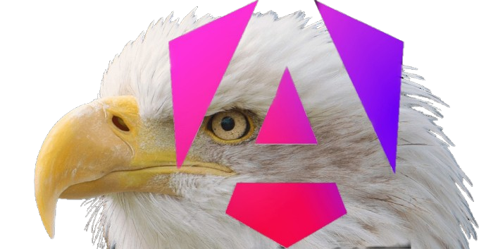

   

   
   
   
   
   
   
   
   

# Angular Eagle Eye

In development -- alpha testing phase.

**Install:**\
npm install --save @webkrafters/ng-eagleeye

**Demo:** [Play with the app on codesandbox](https://codesandbox.io/s/github/webKrafters/ng-eagleeye-app)\
If sandbox fails to load app, please clone and run the demo repo as follows.
<ol>
  <li>open your command line interface in your local machine.</li>
  <li>run <code>git clone https://github.com/webKrafters/ng-eagleeye-app.git</code></li>
  <li>run <code>cd ng-eagleeye-app</code></li>
  <li>run <code>npm install && npm run dev</code></li>
  <li>open the URL displayed at then of this script run.</li>
</ol>

# License

GPLv3

<!-- 

   

   
   
   
   
   
   
   
   

# Angular Eagle Eye

In development.

<table BORDER-COLOR="0a0" BORDER-WIDTH="2">
	<td VALIGN="middle" ALIGN="center" FONT-WEIGHT="BOLD" COLOR="#333" HEIGHT="250px" width="1250px">
	  COMPATIBLE WITH ANGULAR VERSIONS 16.0.0 AND BEYOND. 
	  <a href="https://www.npmjs.com/package/@webkrafters/ng-eagleeye">Angular Eagle Eye</a>
   </td>
</table>
<ul>
   <li> Ready for use anywhere in the app. No Provider components needed.</li>
   <li> Automatically prevents unnecessary cascading re-renders when used with the <a href="https://ng-eagleeye.js.org/getting-started/#connect-usage"><code>connect</code></a> Stream API.</li>
   <li> Auto-immutable update-friendly context. See <a href="https://ng-eagleeye.js.org/concepts/store/setstate"><code>store.setState</code></a>.</li>
   <li> A context bearing an observable consumer <a href="https://ng-eagleeye.js.org/concepts/store">store</a>.</li>
   <li> Recognizes <b>negative array indexing</b>. Please see <a href="https://ng-eagleeye.js.org/concepts/property-path">Property Path</a> and <code>store.setState</code> <a href="https://ng-eagleeye.js.org/concepts/store/setstate#indexing">Indexing</a>.</li>
   <li> Only re-renders subscribing components (<a href="https://ng-eagleeye.js.org/concepts/client">clients</a>) on context state changes.</li>
   <li> Subscribing component decides which context state properties' changes to trigger its update.</li>
   <li>OOB Support for framework-agnostic state sharing among applications. Simply create an <a href="https://auto-immutable.js.org/intro/">Auto Immutable</a> instance to pass around as the <code>value</code> argument for this or any <a href="https://eagleeye.js.org">Eagle Eye</a> based state manager instances.</li>
</ul>

**Name:** Angular Eagle Eye.

**Usage:** Please see <b><a href="https://ng-eagleeye.js.org/getting-started">Getting Started</a></b>.

**Demo:** [Play with the app on codesandbox](https://codesandbox.io/s/github/webKrafters/ng-eagleeye-app)\
If sandbox fails to load app, please refresh dependencies on its lower left.

**Install:**\
npm install --save @webkrafters/ng-eagleeye

May also see <b><a href="https://ng-eagleeye.js.org/history/features">What's Changed?</a></b>

Full Documentation: **[ng-eagleeye.js.org](https://ng-eagleeye.js.org)**

# License

GPLv3 -->
